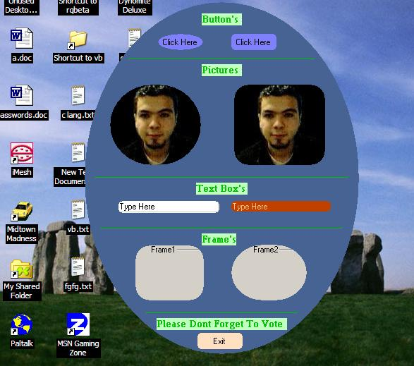

## Round Form,buttons,frames,everything

### Description

this code will show you how to make the controls rounded and it will gives them a new look

if u get bored from the vb GUI this is for you

its EASY AND SIMPLE NO OCX look At the screen Shot!

if u like it please vote.
 
### More Info
 

             |
---                |---
**Submitted On**   |2003-01-02 02:06:02
**By**             |[Ahmad Mami](https://github.com/Planet-Source-Code/PSCIndex/blob/master/ByAuthor/ahmad-mami.md)
**Level**          |Intermediate
**User Rating**    |4.7 (42 globes from 9 users)
**Compatibility**  |VB 6\.0
**Category**       |[Graphics](https://github.com/Planet-Source-Code/PSCIndex/blob/master/ByCategory/graphics__1-46.md)
**World**          |[Visual Basic](https://github.com/Planet-Source-Code/PSCIndex/blob/master/ByWorld/visual-basic.md)
**Archive File**   |[Round\_Form152199122003\.zip](https://github.com/Planet-Source-Code/ahmad-mami-round-form-buttons-frames-everything__1-42081/archive/master.zip)

